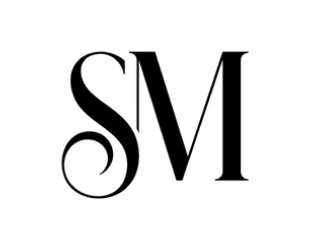
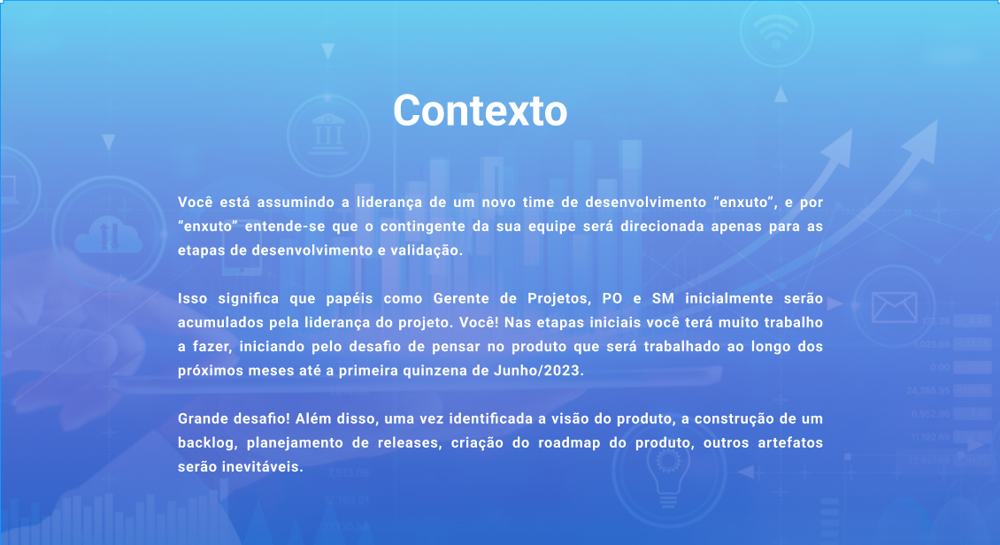
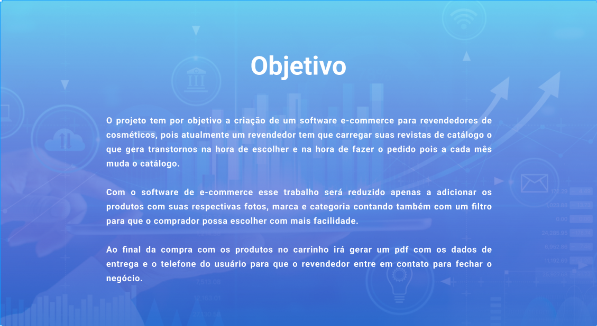
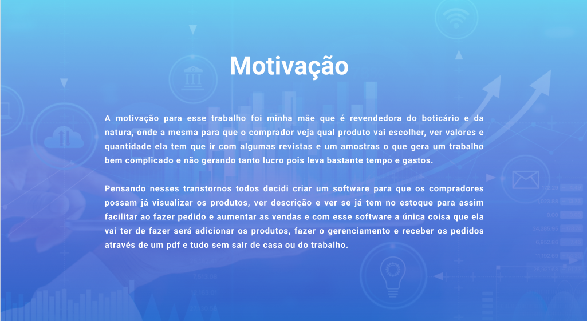
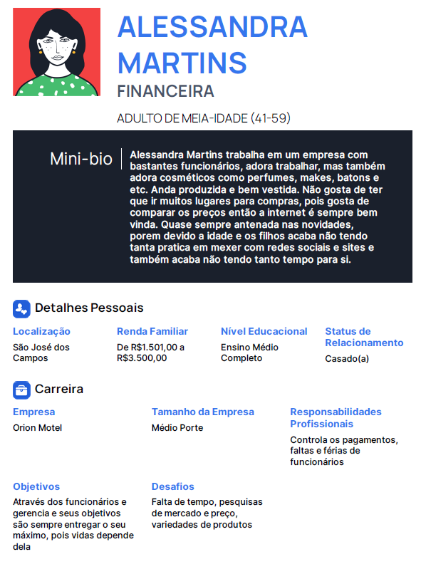
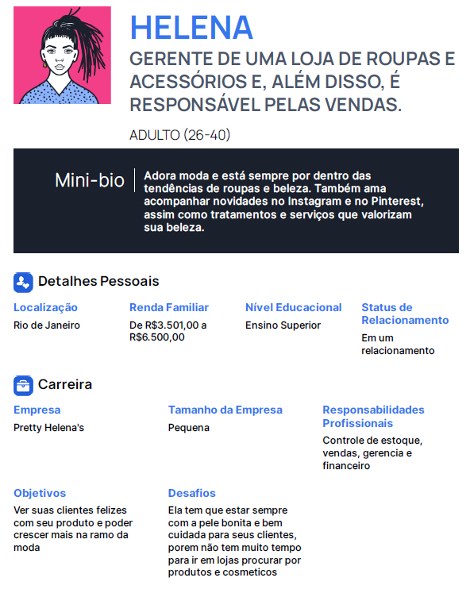
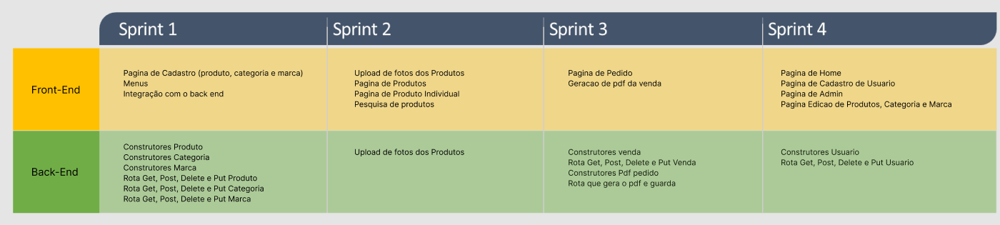

<h1 align="center"> 
  
</h1>

 

<a href ="#contexto"> Contexto </a>  • 
<a href ="#objetivo"> Objetivo </a>  • 
<a href ="#motivação"> Motivação </a>  • 
<a href ="#personas"> Personas </a>  • 
<a href ="#model_canvas"> Project Model Canvas </a>  • 
<a href ="#product_backlog">Product Backlog </a>  •
<a href ="#cronograma"> Sprints </a>  • 
<a href ="#roadmap"> Roadmap </a>  •
<a href ="#equipe"> Equipe </a> 
 

 

<h2 id="contexto">Contexto</h2>

<h2 align="center"> 
</h2>

<h2 id="objetivo">Objetivo</h2>

<h2 align="center"> 
</h2>

<h2 id="motivação">Motivação</h2>

<h2 align="center"> 
</h2>

<h2 id="personas">Personas</h2>

  
Alessandra

  <h2 align="center"> 
    
  </h2>

  
Helena

  <h2 align="center"> 
    
  </h2>

<h2 id="model_canvas">Project Model Canvas</h2>

<!--add product backlog figma figma-->
<h2 align="center">
<!-- </h2> -->

<h2 id="product_backlog">Product Backlog</h2>

<!--add product backlog figma figma-->
<h2 align="center">
</h2>

<h2 id="cronograma">Cronograma das Sprints</h2>

- 
 Kick-Off - 12/03/2023

- <a href="https://github.com/Grupo1API/TecSus/tree/main/readme/sprint_1">Sprint 1</a> - 13/03/2023 a 02/04/2023 
- <a href="https://github.com/Grupo1API/TecSus/tree/main/readme/sprint_2">Sprint 2</a> - 03/04/2023 a 23/04/2023
- <a href="https://github.com/Grupo1API/TecSus/tree/main/readme/sprint_2">Sprint 3</a> - 24/04/2023 a 14/05/2023   
- <a href="https://github.com/Grupo1API/TecSus/tree/main/readme/sprint_2">Sprint 4</a> - 15/05/2023 a 04/06/2023  

<!--add cronograma sprints figma-->
<h2 align="center"> 
</h2>

<h2 id="roadmap">Roadmap</h2>
<h2 align="center">
</h2>

<h2 id="equipe">Equipe</h2>

    <table>
      <tr id="head_table">
        <th>Nome</th>
        <th>Função</th>
        <th>LinkedIn</th>
        <th>GitHub</th>
        <th>Avatar</th>
      </tr>
      <tr id="linha_table">
        <td>Julio Cesar</td>
        <td>Desenvolvedor</td>
        <td><a href="https://www.linkedin.com/in/juliocesar2811/">@LinkedIn</a></td>
        <td><a href="https://github.com/juliocesar1316">@GitHub</a></td>
        <td></td>
      </tr>
    </table>
  

