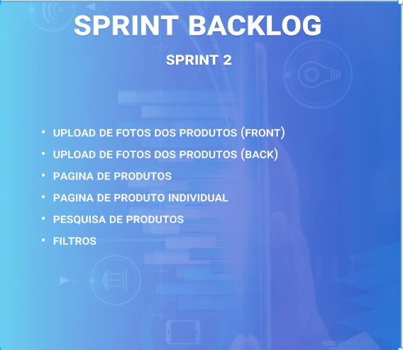

<h1 align="center"> 
  
</h1>

<h2>SPRINT 2</h2>
Nessa segunda sprint foi desenvolvido o upload da foto do produto e foi decidido outra sprint para essa função pois se trata de uma função um pouco complicada, porém deu certo da forma que esperávamos.

Além dessa função de upload foi realizado a página de produtos onde foi mostrado através de um card com algumas informações onde ao clicar é mandado para outra página onde está somente esse produto com a descrição, preço etc., de forma estendida. 

Na página de produtos também foi inserido um filtro onde ao cadastrar uma categoria e/ou marca ele automaticamente é adicionado nesse filtro para ajudar na busca do produto.

<h2>Sumário</h2>
<a href="#dor">DOR (Definition od Ready)</a>    
- <a href="#backlog_sprint_1">Backlog Sprint</a>    
- <a href="#custos">Custos Projeto Sprint</a>    
- <a href="#use_cases"> Use Cases</a>    
- <a href="#wireframes">Wireframes</a>    
- <a href="#burndown_sprint_1">Burndown</a>    
<a href="#dod">DOD (Definition of Done)</a>    
- <a href="#funcionalidades_sprint_1">Funcionalidades implementadas</a>

 

<h2 id="dor" align="center">Definition of Ready</h2>

<h3 id="backlog_sprint_1">Sprint Backlog</h3>
</h1>

 

<h3 id="custos">Custos Projeto Sprint</h3>
</h1>

 

<h3 id="use_cases">Use Cases</h3>

  <table>
    <tr>
      <th>User Story id</th>
      <th>Como um (ator)</th>
      <th>Eu quero (ação)</th>
      <th>Para que seja possível (funcionalidade)</th>
      <th>Prioridade</th>
    </tr>
    <tr>
      <td>1</td>
      <td>Financeira</td>
      <td>Poder escolher o produto que desejo sem ter que ficar indo na lista de produtos</td>
      <td>Criar uma barra de pesquisa que fique constantemente na pagina para pesquisa de produtos </td>
      <td>2</td>
    </tr>
    <tr>
      <td>2</td>
      <td>Financeira</td>
      <td>Uma pagina onde consiga ver os produtos a venda e para poder analisar e comparar precos</td>
      <td>Criar uma pagina de produtos onde vai ser possivel a visualizacao de cards contendo o produto, foto, preco e descricao </td>
      <td>3</td>
    </tr>
    <tr>
      <td>3</td>
      <td>Gerente de loja</td>
      <td>Um metodo que eu possa salvar as imagens que tirei dos produtos ao cadastrar para que seja a cara do produto</td>
      <td>Criar um metodo de upload para que salve as fotos que foram cadastrados para ser requisitados novamente na pagina produtos</td>
      <td>3</td>
    </tr>
    <tr> 
      <td>4</td>
      <td>Gerente de loja</td>
      <td>Uma pagina onde ao clicar em um produto especifico mostre as imagens do produto, descrição e o preco somente desse produto especifico</td>
      <td>Criar uma pagina que ao clicar no card do produto ira enviar para uma apgina desse produto em especifico com seus dados </td>
      <td>2</td>
    </tr>
    <tr> 
      <td>5</td>
      <td>Gerente de loja</td>
      <td>Um metodo de filtro para que possa escolher a marca desejavel e a categoria daquela marca. Para assim facilitar na escolha dos produtos sem ficar rolando a tela</td>
      <td>Criar um metodo de filtro onde ao cadastrar marca e categoria, crie diretamente um filtro na pagina de produtos</td>
      <td>2</td>
    </tr>
  </table>

 

<h3 id="burndown_sprint_1">Burndown da Sprint<h3>

<h3 align="center">
</h3>

 

<h3 id="wireframes">Wireframes </h3>

<h3 align="center"> Barra de pesquisa</h3>

 

<h3 align="center">Método de upload </h3>

 

<h3 align="center">Produtos e Filtros </h3>

 

<h2 id="dod" align="center">Definition of Done<h2>

<h3 id="funcionalidades_sprint_1">Funcionalidades da Sprint</h3>

 

<h3 align="center">Metodo de upload</h3>

 

<h3 align="center">Pagina de produtos e Filtros</h3>

 

<h3 align="center">Pagina de produtos individual</h3>

 

<h3 align="center">Barra de pesquisa</h3>

