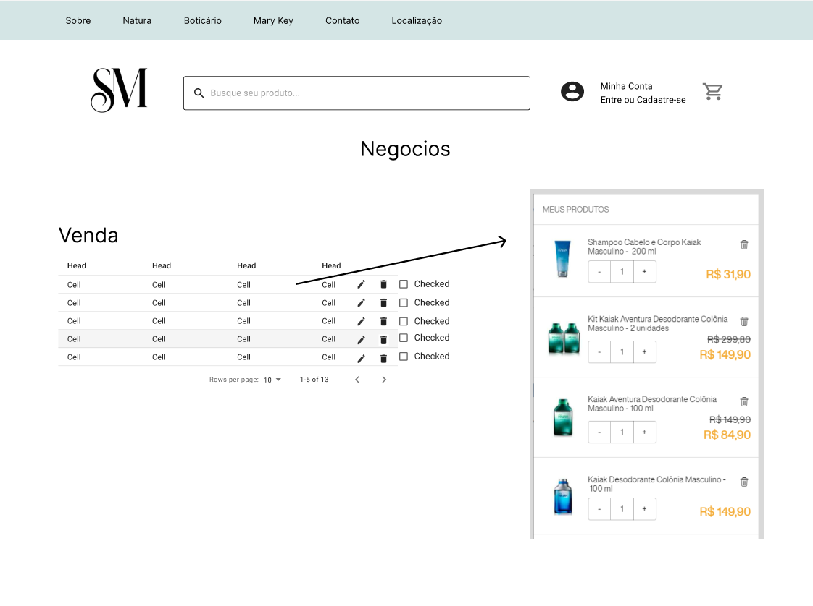
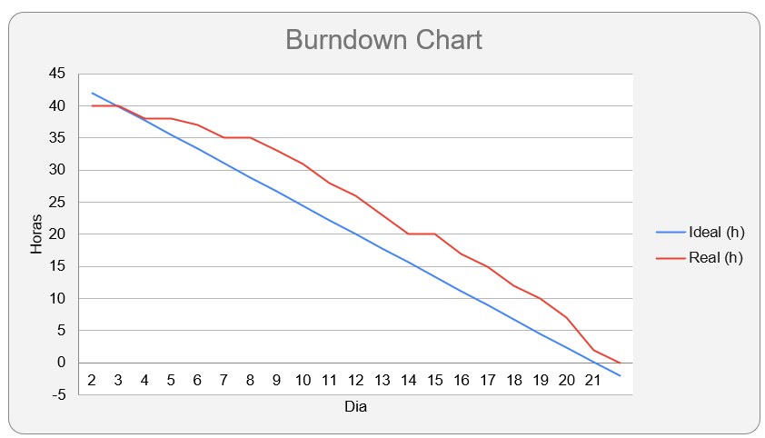

<h1 align="center"> 
  
</h1>

<h2>SPRINT 3</h2>

Nessa terceira sprint foi realizado a função que salva os dados do cliente como cpf, endereço, produtos escolhidos junto com a quantidade, telefone e outras informações adicionais e monta um pdf com esses dados e salva na máquina do adm do site. Além dessa função foi realizado a página de carrinho onde vai mostrar os produtos que foram escolhidos tanta da página de produtos quanto da página de produtos individual onde vai ser possível adicionar os dados caso não tenha feito o login e gerar um pdf com a função criada acima. 

<h2>Sumário</h2>
<a href="#dor">DOR (Definition od Ready)</a>    
- <a href="#backlog_sprint_1">Backlog Sprint 1</a>    
- <a href="#modelo_de_dados"> Modelo de dados</a>    
- <a href="#use_cases"> Use Cases</a>    
- <a href="#wireframes">Wireframes</a>    
- <a href="#burndown_sprint_1">Burndowm Sprint 1</a>    
<a href="#dod">DOD (Definition of Done)</a>    
- <a href="#funcionalidades_sprint_1">Funcionalidades implementadas</a>

 

<h2 id="dor" align="center">Definition of Ready</h2>

<h3 id="backlog_sprint_1">Sprint Backlog</h3>
</h1>

 

<h3 id="use_cases">Use Cases</h3>

  <table>
    <tr>
      <th>User Story id</th>
      <th>Como um (ator)</th>
      <th>Eu quero (ação)</th>
      <th>Para que seja possível (funcionalidade)</th>
      <th>Prioridade</th>
    </tr>
    <tr>
      <td>1</td>
      <td>Gerente de loja</td>
      <td>Para uma pagina de vendas de cosmeticos é preciso ter uma pagina de vendas ou carrinho para que eu faça os pedidos</td>
      <td>Criar uma pagina de vendas de produtos onde a pessoa ira selecionar o produto e a quantidade e ira encaminhar para compra</td>
      <td>3</td>
    </tr>
    <tr>
      <td>2</td>
      <td>Financeira</td>
      <td>Um metodo onde salva os dados do cliente como dados de endereço, produtos do carrinho e outras infromacoes essencial</td>
      <td>Criar um pdf ao final da compra onde salva os dados do cliente como carrinho, dados pessoais e salva na maquina do adm do site</td>
      <td>3</td>
    </tr>
    
  </table>

 

<h3 id="wireframes">Wireframes </h3>

<h3 align="center"> Modal Carrinho</h3>

 

<h3 id="burndown_sprint_1">Burndown da Sprint<h3>

<h3 align="center">
</h3>

 

<h2 id="dod" align="center">Definition of Done<h2>

<h3 id="funcionalidades_sprint_1">Funcionalidades da Sprint</h3>

 

<!-- <h3 align="center">Formulário para cadastro de concessionárias</h3>

 

<h3 align="center">Formulário para cadastro de unidades</h3>

 

<h3 align="center">Formulário para cadastro de contrato de fornecimento de água</h3>

 

<h3 align="center">Formulário para cadastro de contrato de fornecimento de energia</h3>

 

<h3 align="center">Formulário para cadastro conta/fatura de água</h3>

 

<h3 align="center">Formulário para cadastro conta/fatura de energia</h3>
 -->