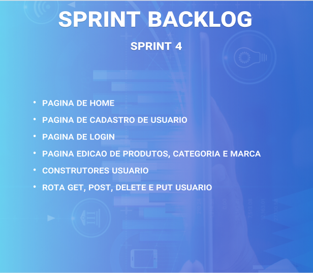
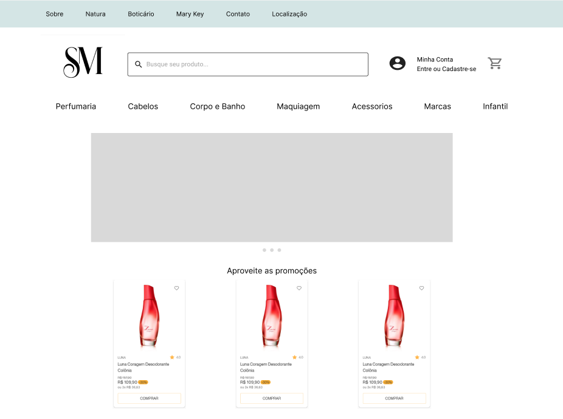
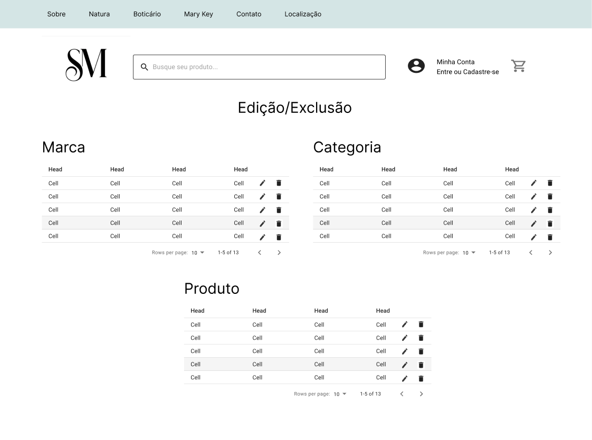
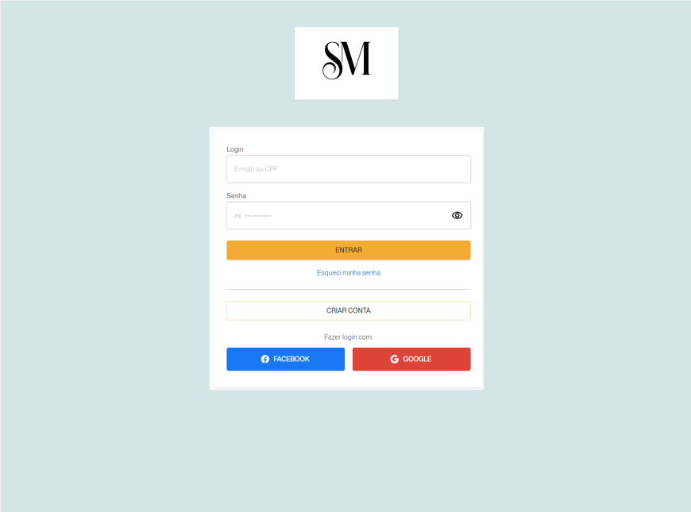
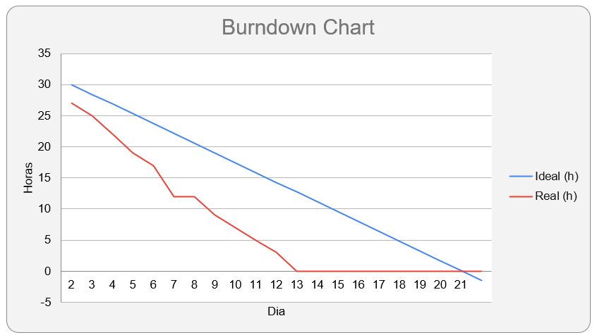

<h1 align="center"> 
  
</h1>

<h2>SPRINT 4</h2>

Nessa primeira sprint o desenvolvimento do projeto se baseou em focar no principal objetivo do sistema, que é o cadastro, desenvolvendo a princípio as principais funções: Cadastro de produto, marca e categoria, alem dessa função foi desenvolvido tambem o menu com a barra de pesquisa e os links porem ainda sem função

<h2>Sumário</h2>
<a href="#dor">DOR (Definition od Ready)</a>    
- <a href="#backlog_sprint_1">Backlog Sprint 1</a>    
- <a href="#modelo_de_dados"> Modelo de dados</a>    
- <a href="#use_cases"> Use Cases</a>    
- <a href="#wireframes">Wireframes</a>    
- <a href="#burndown_sprint_1">Burndowm Sprint 1</a>    
<a href="#dod">DOD (Definition of Done)</a>    
- <a href="#funcionalidades_sprint_1">Funcionalidades implementadas</a>

 

<h2 id="dor" align="center">Definition of Ready</h2>

<h3 id="backlog_sprint_1">Sprint Backlog</h3>
</h1>

 

<h3 id="use_cases">Use Cases</h3>

  <table>
    <tr>
      <th>User Story id</th>
      <th>Como um (ator)</th>
      <th>Eu quero (ação)</th>
      <th>Para que seja possível (funcionalidade)</th>
      <th>Prioridade</th>
    </tr>
    <tr>
      <td>1</td>
      <td>Gerente de loja</td>
      <td>Uma pagina principal onde vai ser possivel visualizar alguns produtos e ter uma cara pro site</td>
      <td>Criar uma pagina de home com alguns produtos aleatorios e uma imagem de informaçoes sobre o site e coo funciona o metodo de compra </td>
      <td>2</td>
    </tr>
    <tr>
      <td>2</td>
      <td>Financeira</td>
      <td>Um metodo de usuario onde ao entrar os dados que foram pedidos ja vao ser inseridos automaticamente no pedido e um metodo que separe os usuarios do adm</td>
      <td>Criacao de um login e um cadastro de usuario onde vao ser pedidos dados essenciais para compra do pedido para que seja inserido automaticamente no pedido no final da pagina de carrinho, alem disso sera inserido uma conta como adm para liberar as paginas de cadastro</td>
      <td>2</td>
    </tr>
    <tr>
      <td>3</td>
      <td>Financeira</td>
      <td>Uma pagina onde possa editar os dados cadastros como quantidade, preco e etc. Alem de um metodo que exclua os produtos que não fazem mais parte do sistema </td>
      <td>Criar um pagina onde sera mostrado 3 tabelas uma de produto, uma de marca e categoria onde vai ser possivel editar os dados cadastrados atraves de um modal e um botao onde vai ser possivel excluir os dados especificos</td>
      <td>3</td>
    </tr>
  </table>

 

<h3 id="wireframes">Wireframes </h3>

<h3 align="center"> Home</h3>

 

<h3 align="center">Pagina de edição e exclusão </h3>

 

<h3 align="center">Login </h3>

 

<h3 id="burndown_sprint_1">Burndown da Sprint<h3>

<h3 align="center">
</h3>

 

<h2 id="dod" align="center">Definition of Done<h2>

<h3 id="funcionalidades_sprint_1">Funcionalidades da Sprint</h3>

 

<!-- <h3 align="center">Formulário para cadastro de concessionárias</h3>

 

<h3 align="center">Formulário para cadastro de unidades</h3>

 

<h3 align="center">Formulário para cadastro de contrato de fornecimento de água</h3>

 

<h3 align="center">Formulário para cadastro de contrato de fornecimento de energia</h3>

 

<h3 align="center">Formulário para cadastro conta/fatura de água</h3>

 

<h3 align="center">Formulário para cadastro conta/fatura de energia</h3>
 -->